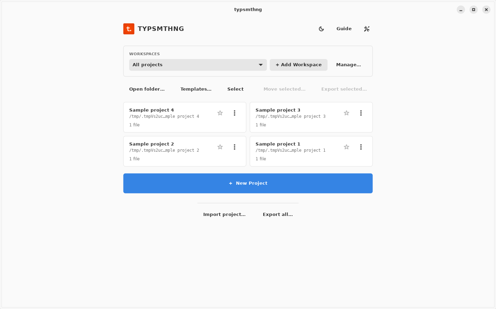
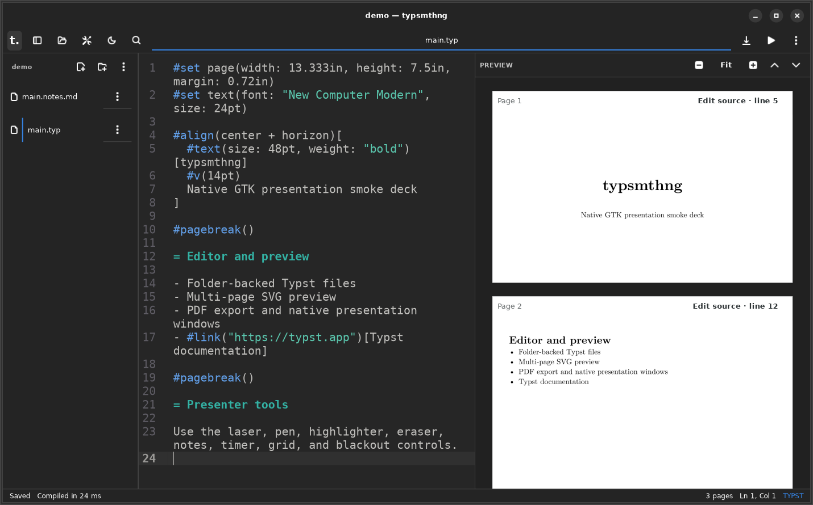

# typsmthng desktop

typsmthng is a native GTK 4 editor and presentation app for Typst. It opens ordinary folders, writes ordinary files, and uses Typst 0.15.1 for preview and PDF output. Live preview keeps the compiler, parsed sources, and fonts in memory between edits; PDF export uses the bundled CLI. The shipped application has no browser, WebView, JavaScript runtime, React renderer, or WASM compiler.

The project is in beta. Keep backups of important work.

The interface uses libadwaita, follows the system appearance, and has one native header bar.

## Screenshots

The project home in light mode:



The editor and live Typst preview in dark mode:



See the [full screenshot gallery and migration notes](docs/gtk4-migration.md) for settings, templates, presentation views, narrow layouts, and implementation details.

## What is included

- Folder-backed projects with safe file creation, rename, duplicate, move, Trash, binary assets, hidden-file control, and external-change detection
- GtkSourceView editor with Typst syntax, diagnostics, line numbers, wrapping, search, undo, Vim-style modal input, and configurable font size
- Debounced writes and latest-wins background compilation
- Multi-page SVG preview with zoom, page navigation, image preview, and PDF export
- Click rendered text or formulas to jump to their source, including local imports
- Diagnostics wait for a 900 ms typing pause while valid previews update independently
- Path and full-text search across the open project
- ZIP project import and export with traversal checks
- LaTeX import for document structure, text styles, lists, links, citations, math, figures, and tables
- Recent and favorite projects, persisted home workspaces, reopen state, and window geometry
- Built-in starters plus live Typst Universe template search and initialization
- System-font control and cached Google Fonts resolution for families declared in Typst source
- Drag-and-drop file import and safe ZIP/Overleaf project import
- Stable-channel update checks with native installer download and launch
- Single-window presentation and presenter view with a separate audience window
- Slide navigation, overview, editable sidecar and inline metadata notes, automatic double-width rendered-note splitting, timer, wall clock, laser pointer, pen, highlighter, eraser, per-slide annotations, and black or white screen
- Positional folder and `.typ` arguments for file-manager and terminal launches

## Requirements for source builds

- Rust 1.93.1 or newer
- GTK 4.12 or newer
- GtkSourceView 5.4 or newer
- libadwaita 1.5 or newer
- Typst 0.15.1

Packaged releases include the pinned Typst compiler. AppImage, macOS, and Windows releases also carry their GTK runtime; deb and rpm packages use the system GTK libraries. Linux binaries target Ubuntu 24.04 or a compatible system with glibc 2.39 or newer.

Install development packages on macOS:

```bash
brew install rust gtk4 gtksourceview5 libadwaita adwaita-icon-theme typst
```

Install development packages on Ubuntu 24.04 or a compatible Debian system:

```bash
sudo apt install build-essential pkg-config libgtk-4-dev libgtksourceview-5-dev libadwaita-1-dev librsvg2-common
```

Windows builds use MSYS2 MinGW64 with `mingw-w64-x86_64-gtk4`, `mingw-w64-x86_64-gtksourceview5`, `mingw-w64-x86_64-libadwaita`, `mingw-w64-x86_64-pkgconf`, and the Rust GNU toolchain.

## Build and run

Check the local toolchain:

```bash
scripts/check-gtk-prereqs.sh
```

Run a development build:

```bash
cargo run -p typsmthng-gtk
```

Open a project or a Typst file directly:

```bash
cargo run -p typsmthng-gtk -- /path/to/project
cargo run -p typsmthng-gtk -- /path/to/project/main.typ
```

Build the optimized binary:

```bash
scripts/build-gtk.sh
```

The binary is written to `target/release/typsmthng`.

## Test

See [native app modules](docs/architecture.md) for responsibilities and the headless/desktop test split.

Run backend and Typst compatibility tests without GTK development libraries:

```bash
scripts/test-typst-compatibility.sh
```

The script uses Typst 0.15.1 from `TYPSMTHNG_TYPST` or `PATH`, or downloads the checksum-verified compiler to `target/tools/typst` on supported platforms (under `CARGO_TARGET_DIR` when set). A supplied compiler must match the pinned version. The suite compares preview and CLI SVG, checks PDF compilation, and tests fonts, packages, dates, diagnostics, and document features. Environment cases run in separate processes so they can run safely alongside other tests.

With the pinned compiler already installed, the equivalent Cargo command is:

```bash
cargo test --locked --workspace --no-default-features --all-targets
```

CLI-dependent tests fail if the compiler is missing or incompatible. The desktop feature is enabled by default; the following full workspace checks also require the GTK development libraries:

```bash
cargo fmt --all -- --check
cargo test --workspace --all-targets
cargo clippy --workspace --all-targets -- -D warnings
```

Preview, PDF export, and speaker-note queries share resolved Typst settings. They honor `TYPST_FONT_PATHS`, `TYPST_PACKAGE_PATH`, `TYPST_PACKAGE_CACHE_PATH`, `SOURCE_DATE_EPOCH`, `TYPST_IGNORE_SYSTEM_FONTS`, and `TYPST_IGNORE_EMBEDDED_FONTS`. Ignore-font variables accept `true` or `false`. Explicit paths, timestamps, and enabled ignore-font flags override environment defaults. Invalid settings produce the same configuration error in both compilation paths. The app keeps environment font directories when adding its Google Fonts cache.

Linux CI also starts the application in Xvfb with `--smoke-test`, then compiles the bundled three-slide fixture and opens both presenter and audience windows with `--presentation-smoke-test`. The same smoke modes can run against a logged-in X11 or Wayland session. `scripts/capture-gtk4.sh` captures the native home, editor, settings, narrow layout, 125% text scaling, and presentation screens into `build/gtk4-screenshots`. It requires Xvfb and dbus-run-session.

## Presentation controls

Start presentation with `Ctrl+Shift+P` or `F5`. Start presenter view with `Ctrl+Alt+P`. On macOS, use Command in place of Control.

- Next slide: Right, Down, Page Down, Space, Enter, N, or J
- Previous slide: Left, Up, Page Up, Backspace, P, or K
- First or last slide: Home or End
- Jump to a slide: type its number, then press Enter
- Black or white screen: B or period, W or comma
- Laser, pen, highlighter, eraser: L, D, H, E
- Clear the current slide: C or Delete
- Slide grid and notes: G or O, S
- Pause or reset the timer: T, R
- Fullscreen: F or F11
- End: Escape

Speaker notes live next to the deck as `<deck>.notes.md`. Annotation points use slide-relative coordinates, so the presenter and audience windows draw the same strokes at different sizes.

## Editor shortcuts

- Save, compile, or export PDF: `Ctrl+S`, `Ctrl+Enter`, `Ctrl+Shift+E`
- Search, settings, or file tree: `Ctrl+K`, `Ctrl+,`, `Ctrl+\`
- Toggle comments or duplicate selected lines: `Ctrl+/`, `Ctrl+D`
- Enable centered scrolling in Settings → Editor to keep the cursor line centered while editing. Manual scrolling remains available; the preference defaults to off.
- Toggle the preview magnifier in the preview toolbar to inspect rendered text at 2× without changing the page zoom.
- Format the current Typst document: `Ctrl+Shift+I`, or "Format document" in the command palette
- Cycle system, light, and dark themes: `Ctrl+J`

Formatting uses Typstyle 0.15.1 and takes one undo step. It preserves selected tokens and scroll position. Carets in whitespace stay near their previous line and character column. Files with syntax errors remain unchanged.

On macOS, use Command in place of Control.

## Packaging

- Linux desktop metadata, Flatpak, AppImage, deb, and rpm files live in `packaging/linux` and `packaging/flatpak`.
- The macOS bundler copies the GTK dylib closure and runtime data before signing the `.app` and creating a DMG.
- The Windows collector copies the GTK DLL and data closure before NSIS builds the installer.
- GitHub Actions compiles the app on Ubuntu, Apple Silicon macOS, Intel macOS, and Windows x64. Release jobs build platform artifacts and SHA-256 checksums.

## Repository layout

```text
native/gtk/           Rust backend and GTK application
native/gtk/src/ui/    Home, editor, preview, search, settings, and presentation UI
packaging/            Linux, macOS, Windows, and Flatpak definitions
scripts/              Local prerequisite and release build helpers
assets/               Application icon and MIME definition
```

## License

MIT. See [LICENSE](LICENSE).
