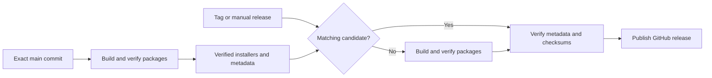

# CI and release packages

Pull requests run the native quality checks and build macOS and both Windows
variants with Cargo's `ci` profile. This profile removes debug symbols and LTO
and disables incremental compilation.
It disables debug assertions so the Windows windowed build selects the same
subsystem as a shipping build. Linux quality checks retain the normal debug and
test profiles. Shipping packages retain the optimized `release` profile.

All native jobs use the compiler pinned in `rust-toolchain.toml`. Cargo caches
include the operating system, architecture, and profile in their shared key.
Compatible release candidates and fallback builds share a cache. CI and shipping
objects use separate caches so an immutable CI cache cannot suppress a shipping
cache save.

## Build once and publish the verified packages

`release-candidate.yml` builds packages on each push to `main`. It can also run
manually on `main`, with unsigned or signed macOS packages. Candidates never
create a public release.



Prepare the final package version and `releases/vVERSION.md` before merging.
Tag the same commit after its candidate succeeds. A release waits up to 45 minutes
for an active matching candidate. Missing, failed, expired, or incompatible
candidates trigger the same reusable package build as a fallback.

Reuse requires a successful candidate workflow in this repository on `main`.
Metadata must match the exact source SHA, version, macOS signing mode, compiler,
repository, and build run. Publishing independently checks that the download
contains exactly seven nonempty regular installers, its metadata, and
`SHA256SUMS`, and verifies every package hash. Public releases contain the seven
installers and checksum manifest. Build metadata stays in Actions.
An existing release tag must resolve to the verified source commit.

Candidates retain verified packages for 14 days and intermediate platform
packages for one day. Compressed installers use artifact compression level zero.
Manual releases can still select an older immutable source. Orchestration tools
come from the workflow commit while application code and version metadata come
from the selected source.

## Parallel Flatpak builds

Flatpak runs alongside the native Linux, macOS, and Windows package jobs. It has
its own SDK-compatible Cargo registry and target caches, with stable sandbox
paths. A changed SDK commit invalidates compiled objects. Builder state and
downloads persist between runs. Sources contain only the selected Git commit,
without host build output or cache directories.
When a module rebuilds, it refreshes extracted source timestamps before Cargo
runs, so commits with older timestamps cannot reuse a stale application binary.

The native package jobs retain their packaged application, installer, updater,
signature, and disk-image checks. Flatpak retains both application and
presentation smoke checks. All jobs must pass before packages become a verified
candidate.
Flatpak smoke checks use a disposable installation and remove it afterward.

## Local validation and timings

```sh
uv run --no-project packaging/release/test_release.py
bash packaging/flatpak/test-build.sh
cargo fmt --all -- --check
cargo build --locked --profile ci --manifest-path native/gtk/Cargo.toml
```

A local warm-dependency application rebuild on Ubuntu 24.04, Rust 1.93.1, with
four Cargo jobs and incremental compilation disabled measured:

| Profile | Application rebuild |
| --- | ---: |
| Existing optimized release profile | 71.77 seconds |
| New CI profile | 4.62 seconds |

Both runs removed only the application's profile outputs before rebuilding.
The CI profile was about 15.5 times faster in this local comparison. This measures
compilation, not a hosted workflow's dependency installation, cold cache, or
packaging time. The new CI binary also passed GTK startup and presentation smoke
checks under Xvfb.

The full application also compiled inside the GNOME 50 SDK. A subsequent cached
Flatpak build skipped both modules and cleanup, built the bundle, and passed
both packaged GTK smoke checks in 43.35 seconds. The disposable installation
was removed and the SDK-compatible Cargo objects remained available.
