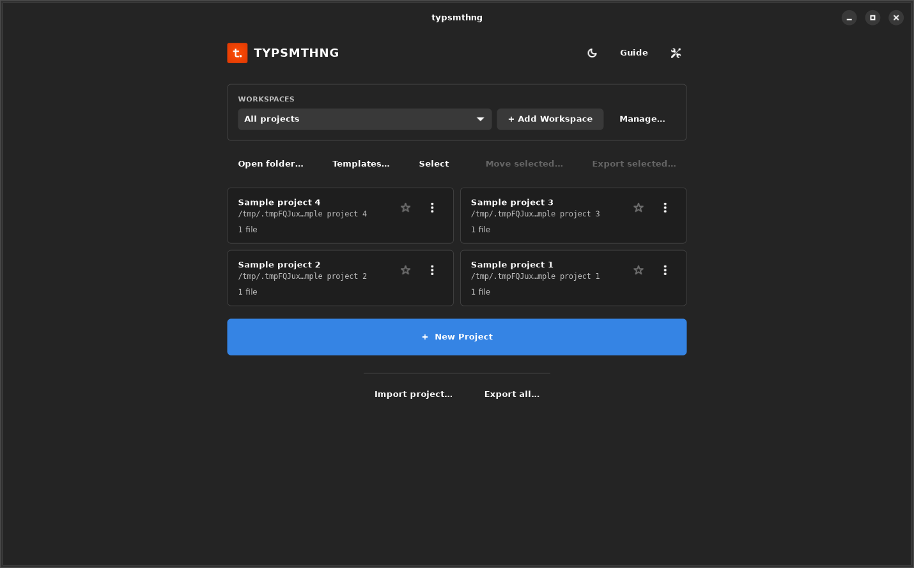
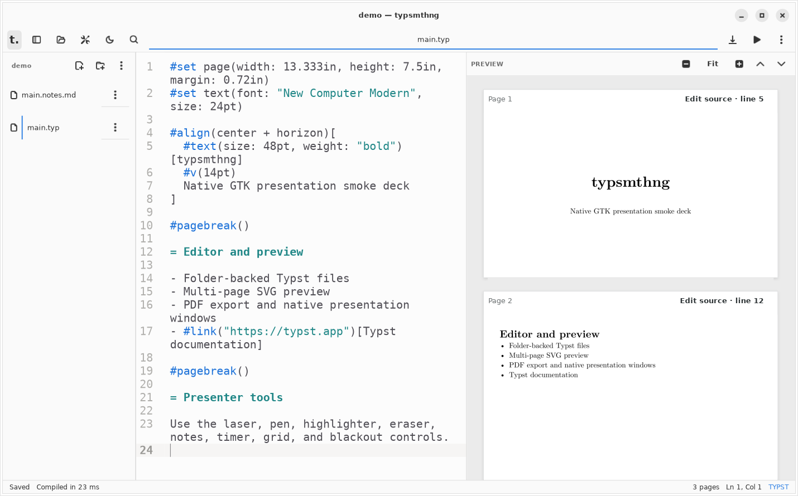
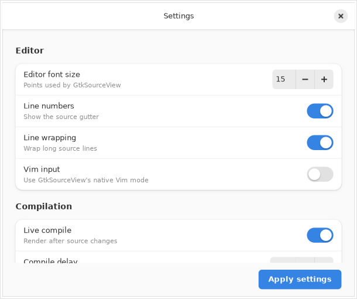
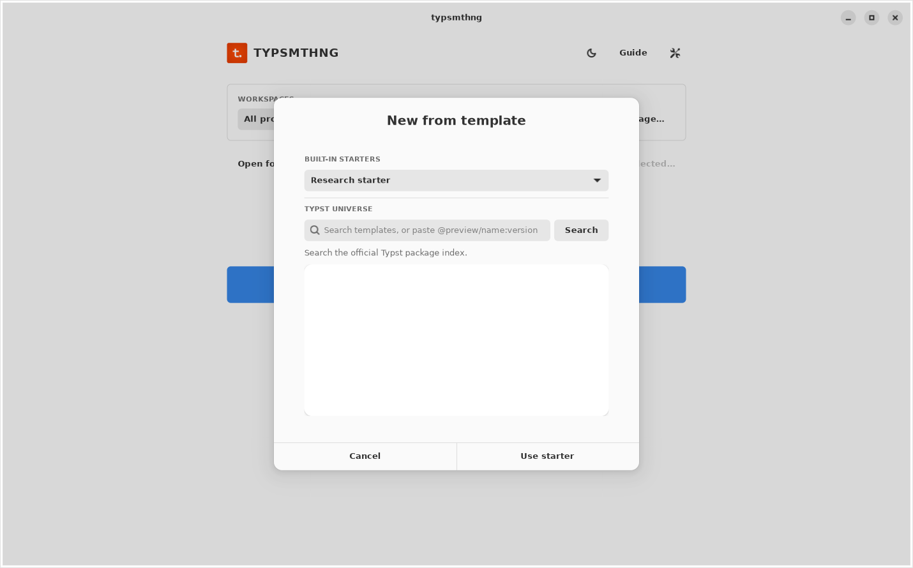
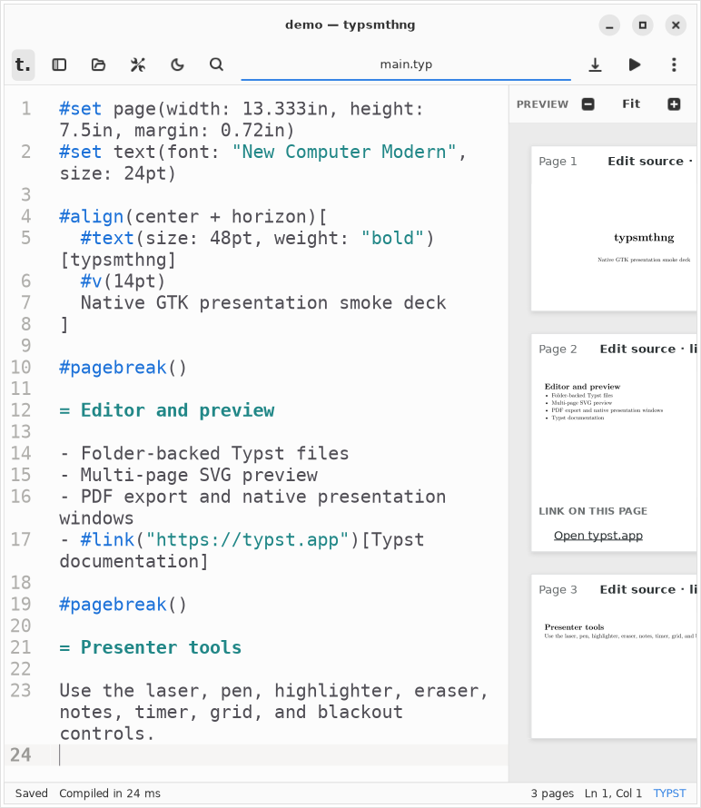
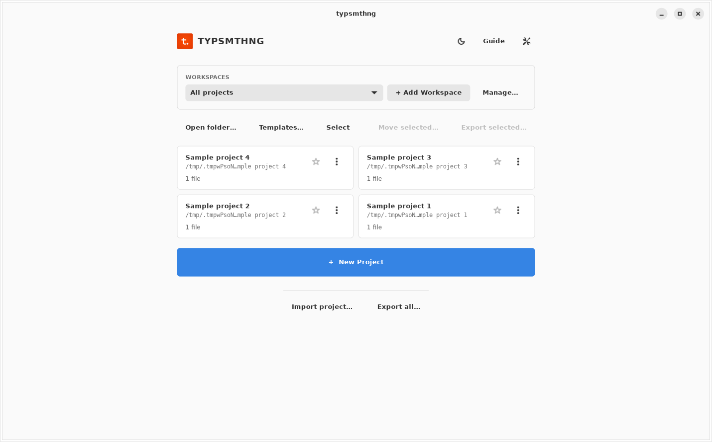
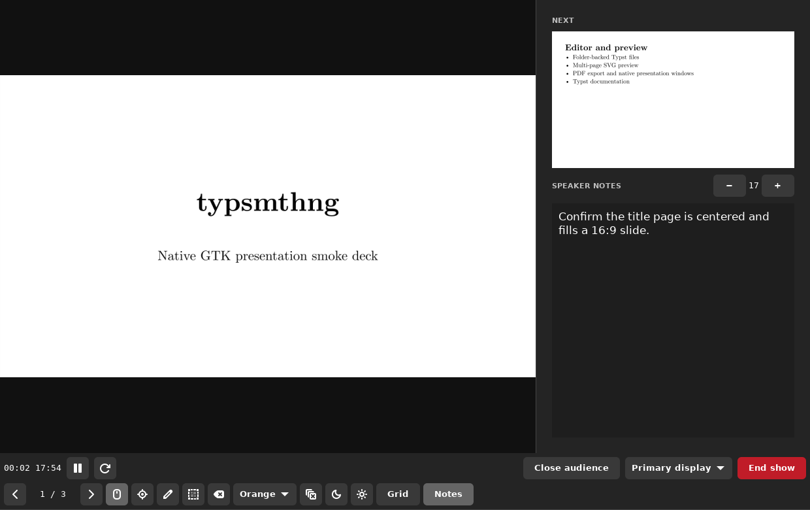
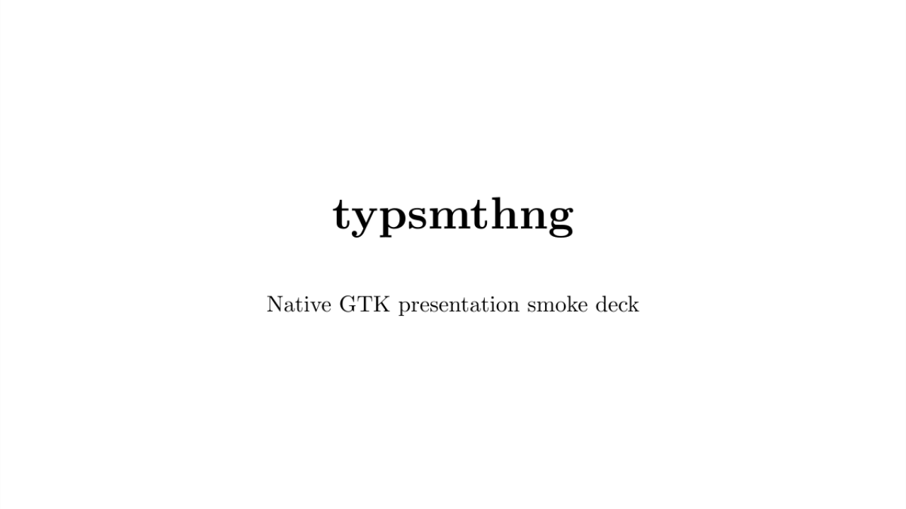
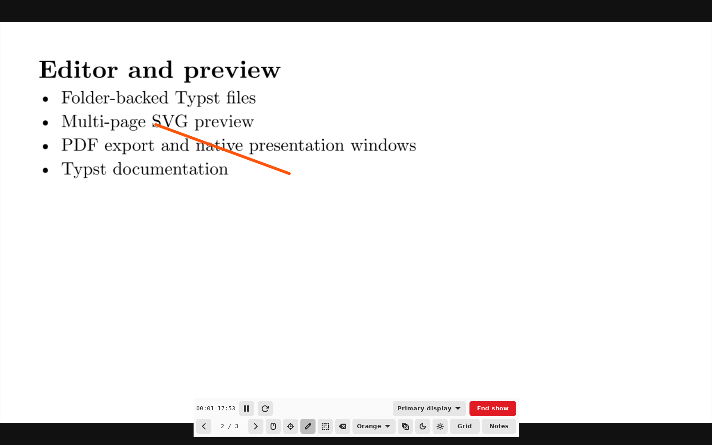

# GTK 4 and libadwaita

The application uses GTK 4, libadwaita and GtkSourceView 5. The Rust compiler, project, storage and archive backend remains intact. There is one native UI implementation.

## Design and execution

- `AdwApplicationWindow`, `AdwToolbarView` and `AdwHeaderBar` provide one native window header and one set of window controls. The home brand/actions row and editor toolbar keep their established positions.
- `AdwStyleManager` follows system appearance live. Explicit light and dark preferences remain available. Editor syntax colors follow the same appearance.
- Primary actions, selection, switches and focus indicators use Adwaita's semantic accent colors. Supported desktop accent preferences are inherited on libadwaita 1.6 and newer. The Ubuntu 24.04 compatibility runtime uses libadwaita 1.5's default accent; Flatpak and newer system runtimes support system accents.
- Settings use native preference groups and action rows with a scrolling body and a fixed Apply button. Utility windows can be dismissed with Escape and reopened.
- File operations use asynchronous `GtkFileDialog`; confirmations and prompts use `AdwAlertDialog`. No deprecated GTK dialog APIs remain.
- GTK 4 textures, pictures, render-node snapshots, gestures and event controllers replace the GTK 3 drawing and controller adapters. Preview textures are reused when content is unchanged; annotations update while dragging.
- GtkSourceView 5 supplies native Vim input. The command bar is visible; `:w` saves and `:q`/`:wq` only close after a successful save. It does not load Vim plugins.
- Initial file loads do not enter undo history. Atomic-save watcher notifications do not reload the editor's own writes, preserving undo/redo.
- The editor hides its sidebar at narrow widths and restores it when widened. Presentation canvases remain independent of the desktop's light/dark appearance.

GTK 4.12, GtkSourceView 5.4 and libadwaita 1.5 are the minimum source-build requirements. Current compatible Rust bindings are locked in Cargo.lock. Linux packages, Flatpak, macOS and Windows workers all build the same source and toolkit.

References: [GTK 4 migration](https://docs.gtk.org/gtk4/migrating-3to4.html), [ToolbarView](https://gnome.pages.gitlab.gnome.org/libadwaita/doc/1-latest/class.ToolbarView.html), [StyleManager](https://gnome.pages.gitlab.gnome.org/libadwaita/doc/1-latest/class.StyleManager.html).

## Validation

Local checks use Ubuntu 24.04, GTK 4.14.5, GtkSourceView 5.12, libadwaita 1.5, Rust 1.93.1 and Typst 0.15.1. Tests cover project persistence, archives, compilation, watchers, document search, preview layout and presentation state. Native interaction checks use real X11 keyboard and pointer input, including pairing, save/undo/redo, native Vim writes, file chooser cancellation, theme cycling, settings reopening, search, drawing and presentation navigation.

```sh
cargo fmt --all -- --check
cargo test --locked --all-targets
cargo clippy --locked --all-targets -- -D warnings
dbus-run-session -- xvfb-run -a env GTK_A11Y=none target/debug/typsmthng --interaction-smoke-test
dbus-run-session -- xvfb-run -a -s '-screen 0 1600x1000x24' timeout 40s scripts/check-gtk4-interactions.sh
scripts/capture-gtk4.sh
```

The release workflow also launches the AppImage in a clean Ubuntu container without GTK or Typst installed, and opens a compiled presentation from the AppImage, Flatpak and macOS bundles. Typst is copied after ELF dependency rewriting to preserve its static executable.

The input test disables portals only inside its isolated Xvfb display, where no desktop portal runs. Normal application launches use the desktop's picker. Screenshots below come from the running application, not mockups. Physical multi-monitor placement, HiDPI compositor behavior and signed/notarized distribution remain separate platform considerations.

## Screenshots




















